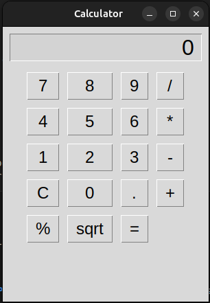

# Calculadora em Python

## Estrutura do projeto

```
calculadora/
├── src/
│   ├── controller/
│   │   └── controller.py
│   ├── model/
│   │   ├── calculator.py
│   │   └── exceptions.py
│   ├── view/
│   │   └── gui.py
│   └── main.py
├── tests/
│   ├── test_calculator.py
│   └── test_controller.py
├── assets/
│   └── gui_screenshot.png
├── requirements.txt
└── README.md
```

## Descrição do projeto

Esta é uma aplicação de calculadora desenvolvida em Python utilizando o padrão **MVC** (Model-View-Controller).
Ela possui operações matemáticas básicas (adição, subtração, multiplicação, divisão), raiz quadrada, porcentagem e tratamento de erros como divisão por zero ou raiz quadrada de números negativos.
A interface gráfica é feita com **Tkinter** e a lógica de cálculo é separada do display.

## Interface Gráfica (GUI)

A calculadora possui uma interface simples e intuitiva.



## Como instalar

1. Clone o repositório:

```bash
git clone https://github.com/seu_usuario/calculadora.git
cd calculadora
```

2. Instale as dependências:

```bash
pip install -r requirements.txt
```

> Observação: neste projeto, não há dependências externas além da biblioteca padrão do Python.

## Como executar

* **Linux/macOS:**

```bash
python3 src/main.py
```

* **Windows (CMD ou PowerShell):**

```cmd
python src\main.py
```

## Exemplo de uso

* Clique nos números para digitar valores.
* Use `+`, `-`, `*`, `/` para operações básicas.
* Use `sqrt` para raiz quadrada e `%` para porcentagem.
* Clique em `=` para obter o resultado.
* Clique em `C` para limpar a calculadora.

## Como rodar os testes

* **Testes do modelo (Calculator):**

  * Linux/macOS:

  ```bash
  python3 -m unittest tests/test_calculator.py
  ```

  * Windows:

  ```cmd
  python -m unittest tests\test_calculator.py
  ```

* **Testes do Controller (interação entre GUI e modelo):**

  * Linux/macOS:

  ```bash
  PYTHONPATH=src python3 -m unittest tests/test_controller.py
  ```

  * Windows (PowerShell):

  ```powershell
  $env:PYTHONPATH="src"; python -m unittest tests\test_controller.py
  ```

  * Windows (CMD):

  ```cmd
  set PYTHONPATH=src
  python -m unittest tests\test_controller.py
  ```

## Contribuições futuras

* Adicionar histórico de operações.
* Implementar suporte a operações científicas avançadas (log, exponencial, trigonometria).
* Melhorar layout da GUI, adicionando cores e temas.
* Criar versão web da calculadora usando frameworks como Flask ou Django.
